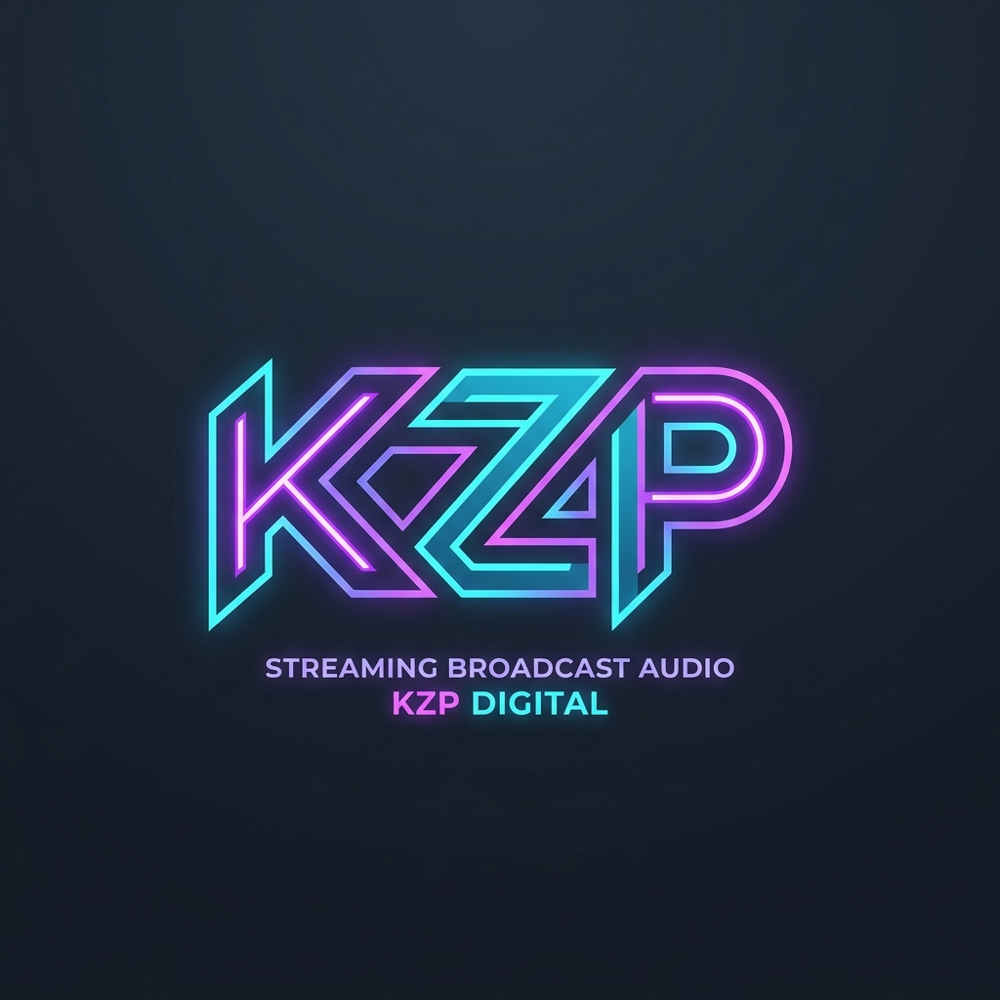

# KizCaption

A lightweight, 100% offline, multilingual live subtitle and translation companion for OBS Studio. Microphone audio is captured locally, transcribed in real time, simultaneously translated into up to three target languages, and rendered cleanly in OBS Studio via standard **Browser Sources**. Completely offline with no paid cloud APIs, no external OBS plugins required, and ultra-low resource overhead.



> **Credits**: Designed and engineered by **kenewjr 2026**.  
> **Visual Identity**: Original **KZP** neon cyan & ultraviolet typography badge (original, royalty-free).

---

## Local Pipeline Architecture

```text
Microphone (WASAPI) → 16 kHz Mono → Silero VAD v5 → Faster-Whisper → Meta NLLB-200 INT8 → OBS Browser Source
```

- **Zero-Latency Pause Detection**: Neural voice activity detection powered by Silero VAD v5 ensures audio segments are dispatched right when speech ends, preserving word boundaries without clipping speech onset. Silent audio consumes zero transcription or translation compute.
- **Persistent Overlay Server**: Lightweight built-in HTTP and WebSocket server running locally on `127.0.0.1:8765`. Remains active even when speech processing is paused, eliminating OBS browser source reconnect penalties.
- **Simultaneous Batch Translation**: Up to 3 target languages are translated in a single batched NLLB-200 inference pass for maximum GPU/CPU efficiency.

---

## Key Features

### 1. Clean 6-Tab Interface (Zero Redundancy)
A sleek, categorized Tkinter desktop dashboard:
- **Bilingual Interface**: English by default, with 1-click header switcher to Bahasa Indonesia (`🌐 English` / `🌐 Bahasa Indonesia`).
- **Tab 1 — Monitor & Quick Setup**:
  - Live audio VU meters (RMS dBFS, Peak dBFS, active VAD indicator).
  - Microphone selector, quick language targets, and software Volume Gain (dB) slider.
  - **Interactive Audio & VAD Calibration Benchmark**: 5-second acoustic test that measures background noise floor & speech acoustics to auto-tune VAD threshold, mic gain, silence hangover ms, and denoiser engine with 1-click apply.
  - **EZ Mode & Resource Templates**: 1-click hardware presets (`Potato / Ultra Low`, `Low Spec / Saver`, `Balanced`, `High Accuracy`, `Ultra Studio`) plus 1-click Hardware Benchmark.
  - Live transcription stream and 3 real-time translation slot monitors.
- **Tab 2 — Engine & VAD**:
  - Speech-to-Text (STT) model selector (`tiny` up to `large-v3-turbo`), device selection (`auto`, `cuda`, `cpu`), and beam size.
  - Machine Translation (MT) NLLB-200 model, compute type, beam size, and CPU thread limits.
  - Silero VAD fine-tuning (speech probability threshold, silence hangover ms, max utterance duration).
  - **Multi-Engine Noise Suppression**: Vocal Clarity DSP, DTLN neural network noise filter (ONNX), and Hybrid Mode.
  - Automated profanity censorship filter (TOS-Safe), gamer/streamer slang normalizer, and 1,000+ expanded Indonesian vocabulary bank with adaptive self-learning.
- **Tab 3 — Caption Style (3 Profiles & Live In-App Preview)**:
  - 1-Click Platform Safe-Zone Presets (YouTube 1080p, Twitch, TikTok Live 9:16 portrait).
  - Independent customization for Slot 1, Slot 2, and Slot 3.
  - **Live In-App Caption Preview**: Real-time canvas preview rendering fonts, colors, outlines, neon glow, and backgrounds without opening an external browser.
  - CSS Import & Export support for every profile.
- **Tab 4 — Models & Resources**:
  - Automated hardware inspection (detected GPU, free VRAM, total RAM, CPU thread count).
  - VRAM/RAM safety checks and disk size requirements for each model.
  - Background model download manager with animated progress, speedometer, and ETA indicators.
  - **Zero Re-download Reinstall Detection**: Central persistent cache (`%LOCALAPPDATA%/KizCaption/models`), Hugging Face cache detection, and 1-Click "Scan Previous Models" button to detect and link existing models automatically across updates or reinstalls.
- **Tab 5 — OBS Setup**:
  - Ready-to-copy Browser Source URLs for Slot 1, Slot 2, Slot 3, and All-in-One Multi-Language modes.
  - One-click "Copy URL" and "Open in Browser" buttons with real-time client connection diagnostics.
- **Tab 6 — About & Diagnostics**:
  - Version info, one-click GitHub Update Checker, KZP branding, license attributions, and `by kenewjr 2026` credit.
  - **Structured Translation Review Log**: Built-in, default-active structured logging of spoken input transcripts, multi-target translation outputs, and STT/MT latencies into `logs/translation_review.jsonl`.
  - **1-Click Export & Clear Review Log**: `📤 Export Translation Log` and `🗑 Clear Translation Log` buttons for easy sharing and quality evaluation.
  - **Copy Recent System Logs**: 1-click clipboard copy of latest session logs (`kizcaption-*.log`) for debugging.

### 2. Modern Custom Scrollbars & Dark/Light Theme
- Slim, elegant 8px custom scrollbars with rounded thumbs and no antiquated arrow buttons.
- Harmonious color schemes:
  - **Dark Mode**: Background `#080B14`, thumb `#252F49`, hover `#806CFF`.
  - **Light Mode**: Background `#F1F4F9`, thumb `#CBD5E1`, hover `#6366F1`.
- Intelligent mousewheel event routing: avoids hijacking scroll events inside text boxes and treeviews.

### 3. Exactly 30 Modern Caption Presets
Pre-tuned aesthetic presets across 6 distinct categories:
- **Minimal**: `Clean White`, `Studio Subtitle`, `Mono Console`, `Bold Contrast`, `Soft Shadow`.
- **Anime / VTuber (Cute & Aesthetic)**:
  - `Sakura`: Soft cherry blossom pink with pastel glow `#FB7185`.
  - `Lavender Glow`: Dreamy magical girl neon violet glow `#C084FC`.
  - `Candy Pop`: Sweet vanilla `#FEF08A` and strawberry pop `#DB2777`.
  - `Pastel Mint`: Refreshing matcha & mint milkshake with soft teal accents.
  - `Manga Stroke`: Shonen manga style with 5px black outline and pop 3D shadow.
- **Card**: `Midnight Card`, `Glass Lite`, `Rounded Slate`, `Paper Light`, `Compact Pill`.
- **Broadcast**: `Lower Third`, `News Accent`, `Sport Strip`, `Interview`, `Documentary`.
- **Neon (Cyberpunk & Glow)**:
  - `Cyber Violet`: Night City aesthetic with intense radial magenta glow `#D946EF`.
  - `Cyan Edge`: Tron Sci-Fi HUD electric ice cyan with blue glow `#06B6D4`.
  - `Electric Lime`: Terminal hacker matrix green with emerald glow `#10B981`.
  - `Synthwave`: 80s outrun sunset purple gradient `#2E1065` to `#701A75` with pink outline.
  - `Sunset Duo`: Warm magenta-orange gradient with razor-sharp borders.
- **Creative**: `Retro Mono`, `Comic Bubble`, `Gradient Ribbon`, `Elegant Serif`, `Stream Badge`.

---

## System Requirements

- **Operating System**: Windows 10 or Windows 11 (64-bit)
- **Python**: 3.11, 3.12, or 3.14 (if running from source)
- **OBS Studio**: Version 28.0 or newer (supports standard Browser Source)
- **Graphics Card (Optional but Recommended)**: NVIDIA RTX 20/30/40/50 series with 4 GB+ VRAM for full CUDA acceleration. Automatic, graceful fallback to CPU is built-in.

---

## Installation & Launch

### Option A: Standalone .EXE (No Python Installation Required)
1. Download the preferred package from [GitHub Releases](https://github.com/kenewjr/kizcaption/releases):
   - **`KizCaption-windows-x64-cuda.zip`**: Recommended for NVIDIA GeForce GTX / RTX users (includes embedded CUDA 12 runtime DLLs).
   - **`KizCaption-windows-x64-cpu.zip`**: Lightweight edition (~100 MB) for PCs/laptops without NVIDIA GPU (Intel / AMD).
2. Extract the archive to any folder on your computer.
3. Double-click `KizCaption.exe`.


### Option B: Running from Source
```powershell
# 1. Clone the repository & create virtual environment
git clone https://github.com/kenewjr/kizcaption.git
cd kizcaption
py -m venv .venv
.\.venv\Scripts\python.exe -m pip install --upgrade pip

# 2. Install core dependencies
.\.venv\Scripts\python.exe -m pip install -r requirements.txt

# 3. (Optional) Install NVIDIA GPU CUDA 12 acceleration:
.\.venv\Scripts\python.exe -m pip install -r requirements-gpu.txt

# 4. Launch the application
.\.venv\Scripts\python.exe main.py
# Or simply double-click start.bat
```

---

## Step-by-Step In-App User Guide

Follow this quick walkthrough after launching KizCaption for the first time:

### Step 1: Verify & Download AI Models (Tab 4 — Models & Resources)
1. Open the application and switch to **Tab 4 (Models & Resources)**.
2. Review the **System Hardware Status** card at the top. The app detects your GPU model, free VRAM, and total system RAM.
3. Check the **Model Status** list:
   - **Silero VAD**: Included out-of-the-box (`models/silero_vad.onnx`).
   - **Whisper STT**: Recommended starting model is `base` or `small` for balanced speed and accuracy. Click **Download** if not yet installed.
   - **NLLB-200 MT**: Click **Download** to retrieve the distilled 600M translation model (~600 MB).
4. Watch the progress bar, download speed (e.g. `⚡ 12.4 MB/s`), and ETA indicator. Once status reads **Ready / Local**, proceed to the next step.

### Step 2: Select Microphone & Calibrate Audio (Tab 1 — Monitor)
1. Switch to **Tab 1 (Monitor & Quick Setup)**.
2. In the **Audio Input** dropdown, select your active microphone (e.g., `Microphone (Realtek Audio)` or virtual audio device).
3. Click the **Calibrate Audio & VAD (Kalibrasi Audio & VAD)** button:
   - Stay silent for 2.5 seconds to measure room noise floor.
   - Speak naturally for 2.5 seconds to gauge voice dynamics.
   - Review the auto-calculated VAD threshold, Gain, and Denoiser recommendations, then click **Apply Recommendations**.
4. Speak into your microphone and observe the **RMS and Peak dBFS meters** lighting up in real time (normal speech should peak in `-18 dBFS` to `-6 dBFS`).

### Step 3: Choose Languages & Translation Targets (Tab 1 & Tab 2)
1. In **Tab 1**, set your **Spoken Language** (e.g., `Indonesian` or `English`).
2. Configure your **Translation Target Slots**:
   - **Target 1**: Primary translation (e.g., `English`).
   - **Target 2**: Secondary translation (e.g., `Japanese`, or choose `Not used`).
   - **Target 3**: Tertiary translation (e.g., `Javanese`, `Sundanese`, or `Not used`).
3. *(Optional)* Switch to **Tab 2 (Engine & VAD)** to toggle:
   - **Noise Suppression**: Choose between `Vocal Clarity (DSP)`, `DTLN (Neural)`, or `Hybrid (Both)` for noisier rooms.
   - **Profanity Filter (TOS-Safe)**: Automatically masks inappropriate language with asterisks (`***`).
   - **Slang Normalization**: Automatically converts informal stream jargon into clean standard vocabulary.

### Step 4: Pick Caption Styles & Layout (Tab 3 — Caption Style)
1. Switch to **Tab 3 (Caption Style)**.
2. Select which slot to customize: **Profile 1**, **Profile 2**, or **Profile 3**.
3. Choose a preset from the **Style Preset** dropdown (e.g., `Cyber Violet`, `Sakura`, `Clean White`, or `Studio Subtitle`).
4. Review the **Live In-App Caption Preview** canvas on the right to see fonts, colors, stroke widths, and semi-transparent cards update instantly.
5. Click **Apply Platform Safe-Zones** to automatically align captions safely for **YouTube (1080p)**, **Twitch**, or **TikTok Live (9:16 vertical)**.

### Step 5: Add Browser Source to OBS Studio (Tab 5 — OBS Setup)
1. Open **OBS Studio**.
2. Switch to **Tab 5 (OBS Setup)** in KizCaption.
3. Click **Copy URL** next to your preferred layout:
   - **All-in-One Multi-Language**: `http://127.0.0.1:8765/overlay.html` (Displays all active translation slots stacked).
   - **Individual Slots**: `http://127.0.0.1:8765/overlay.html?profile=1` (Custom standalone placement for Slot 1).
4. In OBS Studio under **Sources**, click `+` → **Browser**.
5. Give the source a name (e.g., `KizCaption Subtitles`) and click **OK**.
6. In the Browser Source properties:
   - **URL**: Paste the copied URL (`http://127.0.0.1:8765/overlay.html`).
   - **Width**: `1920` (or `1080` for TikTok vertical).
   - **Height**: `300` (or `1920` for vertical layout).
   - Leave "Shutdown source when not visible" unchecked.
7. Click **OK**.

### Step 6: Start Live Subtitling & Stream! (Tab 1 — Monitor)
1. Return to **Tab 1 (Monitor & Quick Setup)** in KizCaption.
2. Click the big green button: **START CAPTION (Mulai Caption)**.
3. Speak into your microphone.
4. Watch your words transcribe and translate instantly in the app monitor, while simultaneously rendering smoothly in your OBS Studio broadcast screen!
5. To stop, simply click **STOP CAPTION**. Your OBS connection stays alive without breaking.

### Step 7: Quality Review & Export (Tab 6 — About & Diagnostics)
- By default, KizCaption records input speech transcripts and multi-target translations into a structured local log (`logs/translation_review.jsonl`) with STT/MT latency metrics.
- Open **Tab 6 (About)** and click **📤 Export Translation Log** to export the `.jsonl` file anytime to evaluate translation quality or train custom vocabulary.
- Click **🗑 Clear Translation Log** to wipe review data when finished.

---

## Check for Updates

To ensure you have the latest performance patches and feature additions:
1. Open **Tab 6 (About)**.
2. Click the **Check for Updates** button.
3. KizCaption queries GitHub Releases. If an update is found, a prompt will provide release notes and a direct download link.

---

## License & Attributions

- **KizCaption Application & UI Pipeline**: Copyright © 2026 **kenewjr**.
- **Faster-Whisper**: MIT License (CTranslate2 & OpenAI Whisper).
- **Silero VAD**: MIT License.
- **Meta NLLB-200**: Meta CC-BY-NC 4.0 License.
